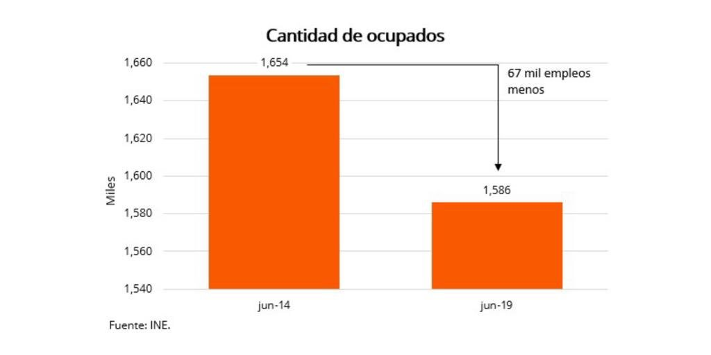

class: center, middle

# Gramática

```{r, include = FALSE}
library(tidyverse)
```


> Es el conjunto de reglas estructurales que gobiernan la composición de oraciones y palabras e un lenguaje.

---

class: center, middle

Una gramática es el tipo de cosas que hay en un lenguaje y las relaciones que tiene que haber entre ellas para generar sentencias válidas en cierto lenguaje (aunque no necesariamente significativas)

---

class: center, middle

En visualización, se refiere a los __elementos__ que hay en un gráfico (puntos, líneas, texto, etc.) y cómo se __interrelacionan__ entre sí.

---

# Ejemplo

<blockquote class="twitter-tweet"><p lang="es" dir="ltr">Esta es la verdad de los números de empleo: desde junio 2014 hasta junio 2019 se perdieron 67 mil empleos. Nada ganamos con hacernos los distraídos, nada ganamos jugando con los números. La realidad es terca. A los problemas hay que mirarlos a los ojos, reconocerlos y encararlos. <a href="https://t.co/b7fh7xTePq">pic.twitter.com/b7fh7xTePq</a></p>&mdash; Ernesto Talvi (@ernesto_talvi) <a href="https://twitter.com/ernesto_talvi/status/1159857066829369344?ref_src=twsrc%5Etfw">August 9, 2019</a></blockquote> <script async src="https://platform.twitter.com/widgets.js" charset="utf-8"></script>


---


# Elementos visuales 
--



--

- Dos rectángulos rojos.

---
# Mapeos estéticos 


--

- El alto de la barra mide la cantidad de empleados en dos momentos del tiempo.


---

# Datos

--
```{r}


empleo <- tibble(
  ocupados = c(1654, 1586),
  fecha = c('jun-14', 'jun-19'),
)
empleo
```

---
# Ggplot()

.pull-left[
```{r ggplt}
ggplot(empleo)
```
]


---
# Mapeo

.pull-left[
```{r fig.show = "hide", mapping}
ggplot(empleo, 
       aes(fecha, ocupados))
```

- x -> fecha
- y-> ocupados
]

.pull-right[
`)
]


---
# Geoms (columnas)

.pull-left[
```{r, fig.show="hide", barras}
ggplot(empleo, 
       aes(fecha, ocupados)) + 
  geom_col()

```
]

.pull-right[
`)
]


---

Comentarios:

- Los ejes no empiezan en 0.
- Bajo ratio de información tinta.


---
# Detalles
```{r}

talvi <- ggplot(empleo, aes(fecha, ocupados)) + 
  geom_col(fill = "orange", width =0.5) + 
  geom_text(aes(x=fecha, y=ocupados, label=ocupados), nudge_y = 10) +
  coord_cartesian(ylim=c(1540, 1670)) + 
  scale_y_continuous(
    labels = scales::number_format(big.mark = '.', decimal.mark = ',')
  ) + 
  theme_minimal() +
  labs(x="Fecha", y = "Miles", 
       caption = "Fuente: Ine.",
       title = "Cantidad de ocupados") + 
  theme(
    plot.title = element_text(hjust = 0.5),
    plot.caption = element_text(hjust = -.1)
  )
  
```

---
```{r, fig.height = 5, dpi = 120}
talvi
```

---
Replicar

```{r echo = FALSE}
replicar_1 <- ggplot(data = mpg) + 
  geom_point(mapping = aes(x = displ, y = hwy, color = class))
replicar_1
```
---
# Solución

```{r echo = FALSE}
replicar_2 <- ggplot(data = mpg) + 
  geom_point(mapping = aes(x = displ, y = hwy, color = class))
replicar_2
```

---

```{r}
ggplot(data = mpg) + 
  geom_point(mapping = aes(x = displ, y = hwy, color = class))
```

---
# Solución

```{r echo = FALSE}
replicar_3 <- ggplot(data = mpg) + 
  geom_point(mapping = aes(x = displ, y = hwy, shape = class))
replicar_3
```

---

```{r}
ggplot(data = mpg) + 
  geom_point(mapping = aes(x = displ, y = hwy, shape = class))
```


---
# Otros Geoms

---
# Boxplots

```{r}
ggplot(data = mpg, mapping = aes(x = class, y = hwy)) + 
  geom_boxplot()
```

# Mapas

```{r}
nz <- map_data("nz")

ggplot(nz, aes(long, lat, group = group)) +
  geom_polygon(fill = "white", colour = "black")
```


---
# Escalas
- Los `aesthetics` mapean del dato al atributo estético de la figura.
En este caso es: (alto de la barra -> nivel de ocupación)
                  posición en el eje x -> fecha)
- Las escalas pasan del atributo estético al dato. (alto -> nivel de ocupación)
---
# Escalas

- Qué tienen en común la leyenda y las etiquetas de los ejes?
- Son escalas
---

# ¿Cómo seguir?
Bibliografía

- R for Data Science (Capítulo 3)

Introducción a ggplot y algunos piques.

- Kieran Healy: Visualización con ejemplos de R
- Claus Wilke: Visualización
- Roger Peng: Programación en ggplot


