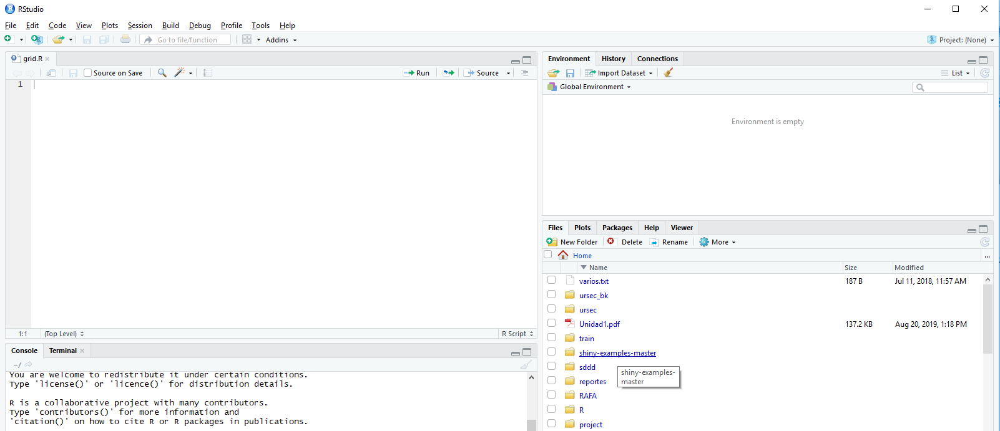
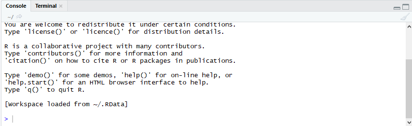
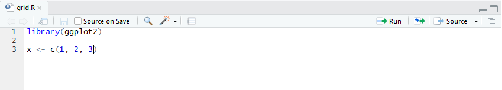
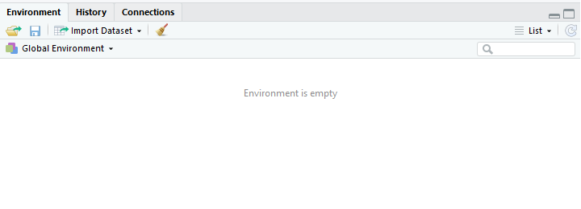

```{r setup, include=FALSE}
options(htmltools.dir.version = FALSE)
library(tidyverse)
```

## ¿Qué es R?

* Paquete estadístico (SPSS, STATA, Excel(?))
* Open Source
* Ecosistema de herramientas (RStudio, dplyr)

---

## ¿Por qué R?

* Análisis reproducible
* Ecosistema open source

---

## Ejemplo de eco sistema

* Stack Overflow
* Markdown
* Shiny

---
## Ejemplo de análisis reproducible

* Importar un csv
* Armar un reporte
* Algo de texto intercalado
* Tablas/Cruces
* Graficos
* Sale a pdf
* Cambiar un dato en el csv
* Volver a correr el reporte


---
## Scripts

* Es la clave para que el análisis sea reproducible
* Tiene costos fijos, pero no es tan difícil (este ejemplo lleva X líneas de código)
* Es más gratificante


---

## Rstudio

- Es una ambiente de desarrollo para R.

<div align="center">

</div>

---
- Tiene varias herramientas que nos facilitan la interacción con R:
  - Consola
  - Environment
  - Editor de texto
  - ...
---

## Consola

- Es la forma más básica de interactuar con R

<div align="center">

</div>


```{r}
6*8
2^6
```  
  
* Arriba y abajo para scrollear los comandos

---
# Editor


<div align="center">

</div>

---
# Ambiente

<div align="center">

</div>

---
## Funciones predefinidas


```{r}
sqrt(2)
```

---
## Variables

* Sirven para almacenar resultados intermedios y organizar los programas:

```{r}
RaizDeDos <- sqrt(2)
HorasPorAnio = 365 * 60
```

* En Excel y Stata no existen (!)

---
## Ambiente (environment)

* Es el conjunto de objetos disponibles a través de variables
```{r}
ls()
```

---
## Funciones definidas por usuarios

* Es el conjunto de objetos disponibles a través de variables:

```{r}
MyAbs <- function(x) {
    if ( x < 0 ) -x
    else x
}
MyAbs(-1)
MyAbs(2)
```

---

## Data frames

Son similares a planillas de excel (tienen filas y columnas)
```{r}
who <- read.csv("data/WHO.csv")
head(who$Country) # 
```

* `head` es una función que me muestra los primeros valores de un vector
```{r}
head(who$Country) 
```


---
## Importar archivos

```{r}
who <- read.csv("data/WHO.csv")
# subset
who_euro <- subset(who, Region=="Europe")
# salvar como csv
write.csv(who_euro, file="data/euro.csv")
```

---
##Info sobre el data frame

```{r}
nrow(who)
nrow(who_euro)
ncol(who)
names(who)
```


---
## Estadísticas descriptivas

```{r}
summary(who)
```

---

## Vectores

* Son la base de los data frames (un data frame es una lista de vectores (?))
* Muchas funciones trabajan con vectores
* Para crear un vector de números uso la función *c*:

```{r}
vec <- c(2, 3, 5, 8, 13)
vec
```
- Accedo por el índice a cada componente
```{r}
vec[3]
```

---

## Vectores (2)

* Pueden ser de texto
```{r}
counts <- c("Brazil", "China", "India", "Switzerland", "USA")
life_exp<- c(74, 76, 65, 83, 79)
```
* Para crear un data frame a partir de vectores:
```{r}
country_data <- data.frame(counts, life_exp)
str(country_data)
```

---
##Vectores (3) -Operador $

* El operador *$* me permite acceder a un item de una lista
```{r}
country_data$pop <- c(199000, 1390000, 1240000, 7997, 318000)
str(country_data)
```
* ¡Cuidado con el orden!

---


## Visualización

- ¿Cuál es la relación entre el PIB y la tasa de fertilidad?
```{r,  fig.width=4, fig.height=4}
plot(who$GNI, who$FertilityRate)
```


---
## Subset

Hay dos países que no siguen la relacion negativa:
```{r}
outliers <- subset(who, GNI > 80000 | (FertilityRate > 5 & GNI > 20000))
outliers[c("Country", "GNI", "FertilityRate")]
```


---
##Histogramas

```{r}
hist(who$CellularSubscribers)
```


---
##Boxplots

```{r}
boxplot(who$LifeExpectancy ~ who$Region)
boxplot(who$LifeExpectancy ~ who$Region, xlab="", ylab="Life Expectancy", main="Life Expectancy by Region")
```

---
##Importar funcionalidad

La función library permite importar "bibliotecas"

```{r}
## install.packages("readstata13")
library(readstata13)
writing <- readstata13::read.dta13("data/writing.dta")
head(writing)
```


---
## Tidyverse

- Es un conjunto de librerías para tareas comunes en análisis de datos
- Es un dialecto de R


---


##`%>%`

Sirve para combinar funciones y poder leerlas de izquierda a derecha.

```{r eval=FALSE}
x %>% f(y) 
#es equivalente a 
f(x,y)
```

---

##`%>%` (2)

El nombre de los omnívoros que duermen más de 15 horas:

```{r}
select(filter(msleep, sleep_total > 15), name)
```

---

Es equivalente a:

```{r}

msleep %>%
  filter(sleep_total > 15) %>%
  select(name)
  
```
