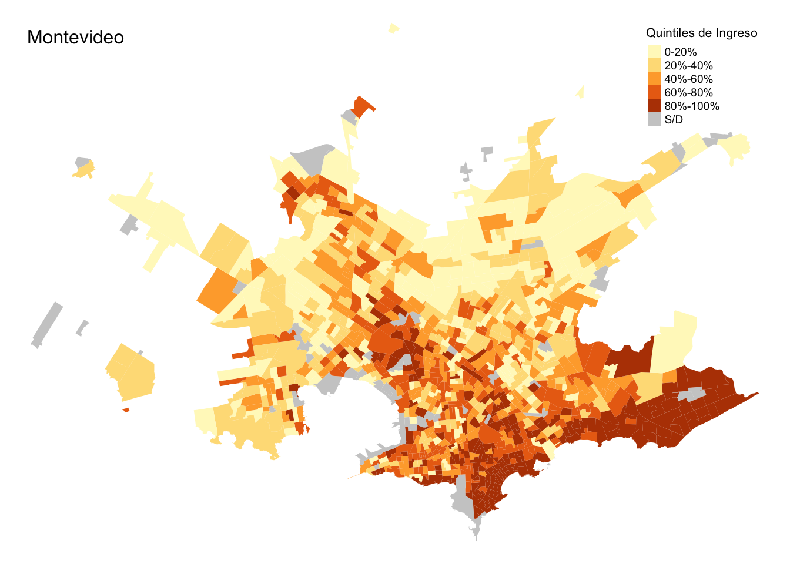

```{r setup, include=FALSE}
options(htmltools.dir.version = FALSE)
library(dplyr)
```

# Distintos tipos de mapa

- Interactivos (`leaflet` + `shiny`)
- Estáticos (`ggmap`, `tmap`)

---

# Choropleth

- Es un tipo de mapa estático donde mapeamos el color del área a alguna variable



---
# Información Necesaria

- Las formas de las áreas (departamentos de Uruguay, localidades de Montevideo, países).

- La variable que queremos graficar.

---

# Formas

- Las formas de las áreas geográficas que necesitamos provienen de sistemas de información cartográficos.

- En Uruguay, el INE [publica mapas](http://www.ine.gub.uy/web/guest/vectoriales) de los deptos, las localidades y los segmentos censales.

---

# Datos

```{r warning=FALSE}
library(readr)


df <- read_csv("data/data.csv", col_names = c("id_depto", "depto", "n", "x")) %>% 
  select(1:3)

```

---

# Ver objeto 

```{r}
head(df)
```

---
# Mapa

Usamos `sf`, una librería para manejar datos geográficos (puede ser difícil de instalar)

```{r}
library(sf)

# Cargar mapa
mapa_deptos <- st_read('shps/ine_depto.shp')


```

---

# Estructura

- Es un `data.frame` con atributos normales (AREA_KM2, PERIMETER, etc.) y atributos geométricos (`geometry`). 

- En este caso es un `sfc_MULTIPOLYGON`.


```{r}
str(mapa_deptos)


```
---

# Objetos geográficos

- Hay varios tipos de objetos geométricos que se usan para representar atributos geográficos. 
- Ver [el capítulo 2 de Geocomputation with R](https://geocompr.robinlovelace.net/spatial-class.html#intro-sf) para más información.
---

```{r}
# Plotear
plot(st_geometry(mapa_deptos))
```

---

# Pegar los datos

Como columnas en el `data.frame` del mapa (depto, n):
```{r}
mapa_deptos <- mapa_deptos %>% 
  left_join(df, by=c("DEPTO"="id_depto"))
```
---


```{r}
mapa_deptos
```


---
# Choropleth con tmap

- Mapeamos el color del polígono a la variable `n`

```{r warning=FALSE}
# tmap
# https://cran.r-project.org/web/packages/tmap/vignettes/tmap-getstarted.html

library(tmap)

mapa <- tm_shape(mapa_deptos) +
  tm_borders() + 
  tm_polygons("n")
```

---


# Mapa

```{r warning=FALSE}
mapa
```


- 